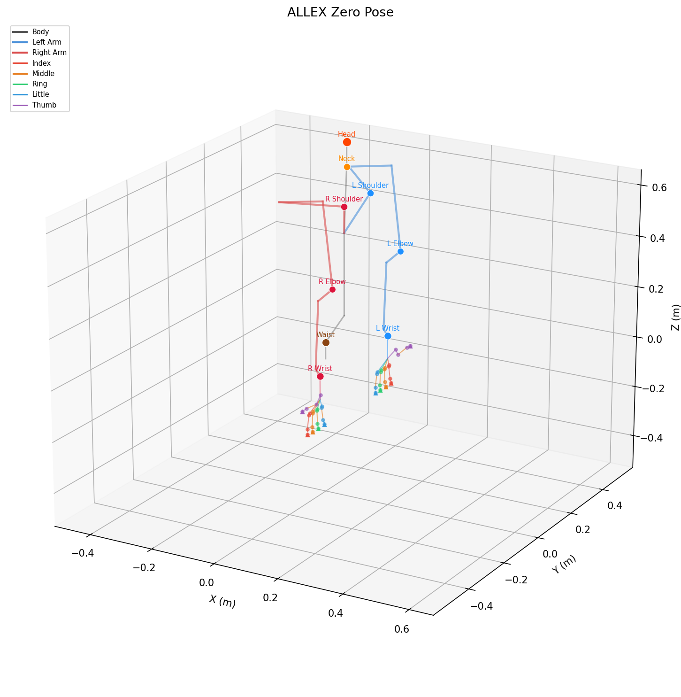
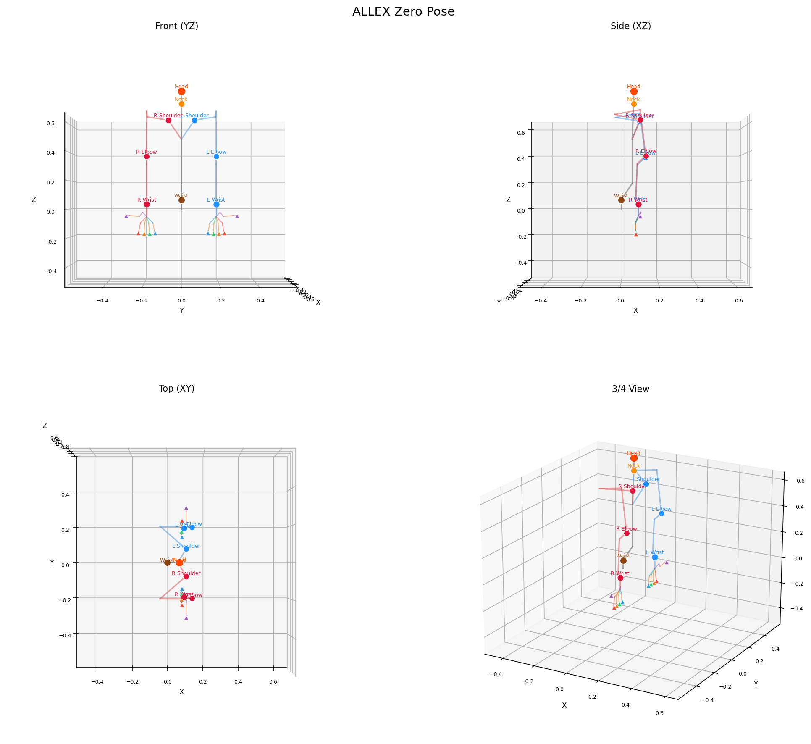

# Human-Robot Visualization

3D visualization and forward kinematics tools for comparing human body tracking data (EgoDex / Ego10K) with ALLEX robot trajectories.



## Project Structure

```
human_robot_viz/
├── assets/
│   └── allex_v2_urdf/          # ALLEX URDF model
├── samples/                     # Sample HDF5 datasets
│   ├── egodex/                  #   EgoDex (ARKit body tracking)
│   └── ego10k/                  #   Ego10K (HaWoR + camera extrinsics)
├── scripts/
│   ├── plot_trajectories.py     # Main visualization script
│   └── plot_zero_pose.py        # ALLEX zero-pose skeleton plot
├── utils/
│   ├── name_utils.py            # Joint/link name constants, color generation
│   ├── kinematics_utils.py      # Forward kinematics (NumpyFK), trajectory computation
│   ├── data_utils.py            # Dataset loading (HDF5, LeRobot)
│   └── coordinate_utils.py      # ARKit → ALLEx coordinate conversion
└── vis_html/                    # Output HTML visualizations
```

## Coordinate Convention

All data uses the **ROS / robot convention** (right-handed):

```
       Z (up)
       │
       │
       │
       └───── Y (left)
      /
     /
    X (forward)
```

| Axis | Direction | Note |
|------|-----------|------|
| **+X** | Forward | Robot facing direction |
| **+Y** | Left | |
| **+Z** | Up | Gravity is -Z |

This matches the ALLEX FK coordinate frame where the waist (hip) is at the origin.

### Multi-View Zero Pose



## HDF5 File Structure

Sample datasets follow the [EgoDex](https://github.com/AllenMaa/egodex) format. Each `.hdf5` file contains one episode:

```
*.hdf5
├── camera/
│   └── intrinsic                    # (3, 3) float32 — camera intrinsic matrix
├── transforms/                      # World-space SE3 transforms (robot convention)
│   ├── camera                       # (T, 4, 4) — camera-to-world (c2w)
│   ├── hip                          # (T, 4, 4) — hip (root)
│   ├── leftShoulder                 # (T, 4, 4)
│   ├── leftArm                      # (T, 4, 4) — upper arm
│   ├── leftForearm                  # (T, 4, 4)
│   ├── leftHand                     # (T, 4, 4) — wrist
│   ├── left{Finger}Knuckle         # (T, 4, 4) — MCP joint
│   ├── left{Finger}IntermediateBase # (T, 4, 4) — PIP joint
│   ├── left{Finger}IntermediateTip  # (T, 4, 4) — DIP joint
│   ├── left{Finger}Tip             # (T, 4, 4) — fingertip
│   ├── left{Finger}Metacarpal      # (T, 4, 4) — metacarpal
│   ├── right...                     # Same structure for right side
│   ├── neck{1-4}                    # (T, 4, 4) — neck chain
│   └── spine{1-7}                   # (T, 4, 4) — spine chain
└── confidences/
    ├── hip                          # (T,) float32 — per-joint confidence
    ├── leftArm                      # (T,)
    └── ...                          # One per joint
```

Where `{Finger}` is one of: `Index`, `Middle`, `Ring`, `Little`, `Thumb`.

Each transform is a 4x4 SE3 matrix in robot convention (+X forward, +Y left, +Z up). `transforms/camera` stores the camera-to-world extrinsic — use its inverse to convert world-space joints to camera space.

**Ego10K** files additionally contain:
- `transforms_cam/<joint>` — cam-space transforms (robot convention) *(deprecated)*
- `transforms/gravity` — gravity alignment rotation (3x3), if available

## Usage

### Zero Pose Visualization

```bash
# Generate zero pose skeleton images
python scripts/plot_zero_pose.py --output assets/zero_pose
```

### Trajectory Visualization

```bash
# Compare sample datasets (world space)
python scripts/plot_trajectories.py \
    --sample-dirs samples/ego10k samples/egodex \
    --n 1

# Camera-space visualization
python scripts/plot_trajectories.py \
    --sample-dirs samples/ego10k \
    --cam_space --n 1

# EgoDex with ARKit transform + LeRobot datasets
python scripts/plot_trajectories.py \
    --sample-dirs samples/egodex \
    --arkit-datasets egodex \
    --categories egodex_v4 RLWRLD \
    --n 5

# Fingertips only (instead of all hand joints)
python scripts/plot_trajectories.py \
    --sample-dirs samples/ego10k \
    --fingertips-only --n 1
```

Output HTML files are saved to `vis_html/` by default.

### Python API

```python
from utils.kinematics_utils import NumpyFK, get_keypoints
import numpy as np

# Forward kinematics from 48-DOF joint angles
q48 = np.zeros(48)
result = get_keypoints(q48)

print(result["fingertips_right"])   # (5, 3) — right fingertip xyz
print(result["wrist_left"])         # (3,)   — left wrist xyz
print(result["link_transforms"])    # dict of link_name -> (4, 4)

# Batch FK
from utils.kinematics_utils import get_keypoints_batch
q_batch = np.random.randn(100, 48) * 0.1
batch_result = get_keypoints_batch(q_batch)
print(batch_result["fingertips_all"].shape)  # (100, 10, 3)

# Load HDF5 sample data
from utils.data_utils import load_hdf5_episodes
from utils.name_utils import ALL_JOINT_NAMES, ALL_HAND_JOINT_NAMES
from pathlib import Path

trajs = load_hdf5_episodes(
    Path("samples/ego10k"),
    joints=ALL_JOINT_NAMES,
    fingertips=ALL_HAND_JOINT_NAMES,
    cam_space=False,
)
# trajs[0]["waist"]["pos"].shape == (T, 3)
```

## Dependencies

```
numpy
matplotlib
plotly
h5py
pyarrow
```

## ALLEX Robot

ALLEX is a 48-DOF humanoid upper body with 12 additional mimic (coupled) joints, totaling 60 revolute joints. The FK is computed from a URDF model stored in `assets/allex_v2_urdf/`.

| Component | DOF |
|-----------|-----|
| Torso / Spine | 6 |
| Left Arm (shoulder → wrist) | 9 |
| Right Arm (shoulder → wrist) | 9 |
| Left Hand (5 fingers × 3 independent) | 15 (+6 mimic) |
| Right Hand (5 fingers × 3 independent) | 15 (+6 mimic) |
| **Total** | **48 independent (+12 mimic)** |
